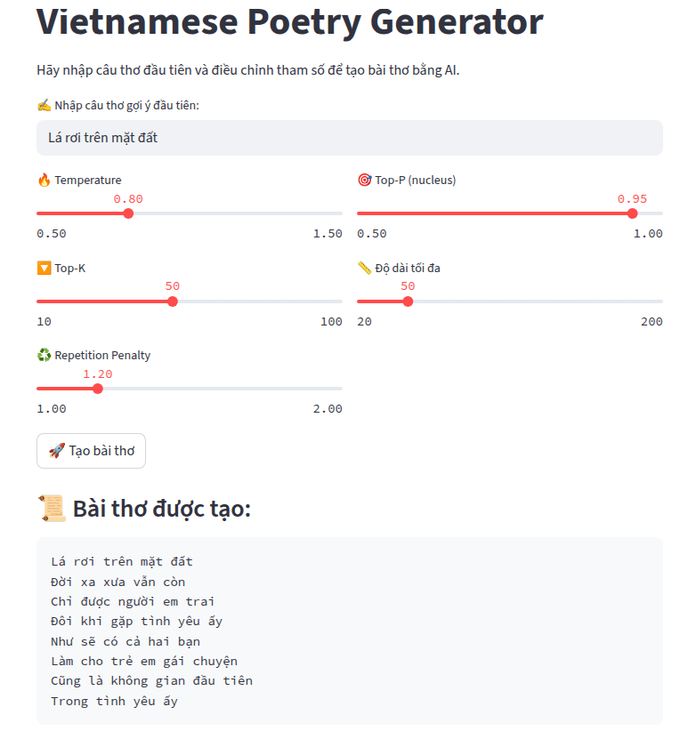

# Vietnamese Poetry Model

## Introduction
a Vietnamese five-word poetry generation model fine-tuned from GPT2-ViWiki (a model publish in HuggingFace), using a curated dataset of 485 stanzas from [thivien.net](https://www.thivien.net/) and deploy on an interactive Streamlit interface.



Some results have generated: 

**Bài thơ 1: "Trăng vàng treo đầu núi"**  
Trăng vàng treo đầu núi  
Mà dốc dốc núi dài  
Như vậy ở đây không có gì  
Nhưng là con người sống lại  
Chứt cái mình không thấy  
Khi một con người chết thì chưa biết  
Khây xa bờ biển  

📊 **Đánh giá:**  
- Số dòng: 7  
- % dòng đúng 5 chữ: 42.9%  
- Tỷ lệ vần đúng: 20.0%  


**Bài thơ 2: "Gió thổi qua cành khô"**  
Gió thổi qua cành khô  
Không có nước trong rừng  
Luyện vui hơn trời mưa  
Một con đường đi trời mưa  
Nên ngày càng nhiều hơn nữa  
Vua cầu mùa đông hơn nữa  
Để bay trở lại trời mưa  
Điêu khó  

📊 **Đánh giá:**  
- Số dòng: 8  
- % dòng đúng 5 chữ: 37.5%  
- Tỷ lệ vần đúng: 50.0%  

---

**Bài thơ 3: "Lá rơi trên mặt đất"**  
Lá rơi trên mặt đất  
Khi gặp một con người  
Cả lòng mình thoát xuống  
Đã thành mưa khắp nơi  
Nên có người con và mẹ  
Không cần ai nào không phải  
Cho đến thời gian giữa hai con ấy  
Nó mang lại  

📊 **Đánh giá:**  
- Số dòng: 8  
- % dòng đúng 5 chữ: 50.0%  
- Tỷ lệ vần đúng: 33.3%  

---

**Bài thơ 4: "Em cười như nắng mai"**  
Em cười như nắng mai  
Một người con chim linh hồn  
Đôi khi đi xa xưa  
Nên đôi khi chân trời lạnh  
Không có ai đến chuyện sống  
Mà không có ai đến chuyện chết  
Sắc nói cho những người khác gặp  

📊 **Đánh giá:**  
- Số dòng: 7  
- % dòng đúng 5 chữ: 28.6%  
- Tỷ lệ vần đúng: 0.0%  

---

**Bài thơ 5: "Sông trôi về nơi xa"**  
Sông trôi về nơi xa  
Cho đến gần bên hạ  
Trong đêm dài ngày đầu trời  
Một ngày đẹp của ba trăm đêm  
Khi ấy ở đâu đó trời xanh mưa  
Hùm thấy có vẻ nắng nắng nóng  
Tựu trong lá rộng  

📊 **Đánh giá:**  
- Số dòng: 7  
- % dòng đúng 5 chữ: 28.6%  
- Tỷ lệ vần đúng: 0.0%  

---

**Bài thơ 6: "Trời xanh không một áng"**  
Trời xanh không một áng  
Đôi khi có em trai bé  
Không chỉ một đời anh  
Đời ngày trước khi chết  
Khi ấy thì còn lại anh  
Súc sáng to chồng ốm đau khổ  
Như còn lại anh ta  
Vua đến trong  

📊 **Đánh giá:**  
- Số dòng: 8  
- % dòng đúng 5 chữ: 50.0%  
- Tỷ lệ vần đúng: 16.7%  

---

**Bài thơ 7: "Hoa nở trong chiều mưa"**  
Hoa nở trong chiều mưa  
Chò đêm trở lại mấy ngày  
Cho tới gặp người và thân mình  
Hùm hoa cá bột bên trên". Bản mang đầy tài sản  
Theo nhà thơ như thế nào  
Tiếng vui tình yêu ở bên trái  

📊 **Đánh giá:**  
- Số dòng: 6  
- % dòng đúng 5 chữ: 16.7%  
- Tỷ lệ vần đúng: 0.0%  

---

**Bài thơ 8: "Tình anh như sóng biển"**  
Tình anh như sóng biển  
Em trẻ em anh ta còn sống  
Người không có ý nghĩa nữa  
Nên người được làm bạn bè  
từ người đến con mình đều thấy  
Anh khi không còn nào tới lại thì thấy  
Và con của mình  

📊 **Đánh giá:**  
- Số dòng: 7  
- % dòng đúng 5 chữ: 14.3%  
- Tỷ lệ vần đúng: 0.0%  

---

**Bài thơ 9: "Bước chân qua phố vắng"**  
Bước chân qua phố vắng  
Một phần tư của thành phố  
Người dân vẫn còn sống trong vùng  
Chỉ có những người đẹp đẹp  
Không có những ai trẻ không đi trong  
Để tránh cái khó khăn  
Gác đẹp hơn đời còn lại  

📊 **Đánh giá:**  
- Số dòng: 7  
- % dòng đúng 5 chữ: 28.6%  
- Tỷ lệ vần đúng: 40.0%  

---

**Bài thơ 10: "Học, học nữa, học mãi"**  
Học, học nữa, học mãi  
Những vị trí khác đã trở nên nét  
Mà đã mang lại những lý luận  
Theo ý nghĩa mà là đời sống  
Khá trước khi còn sống và chết  
Dân gia đình có thể nói mình  

📊 **Đánh giá:**  
- Số dòng: 6  
- % dòng đúng 5 chữ: 16.7%  
- Tỷ lệ vần đúng: 0.0%  

---

**Bài thơ 11: "Chiều buông nhẹ bên sông"**  
Chiều buông nhẹ bên sông  
Không còn yêu cầu ta  
Qua một thế kỷ nữa  
Đôi khi gặp anh em hay mẹ  
Cho dù đến đâu một đêm nữa  
Có hai anh chị cùng chồng  
Trong ngày mưa mưa và mưa thì rất đẹp  

📊 **Đánh giá:**  
- Số dòng: 7  
- % dòng đúng 5 chữ: 42.9%  
- Tỷ lệ vần đúng: 20.0%  

---

**Bài thơ 12: "Lặng lẽ hàng cây đứng"**  
Lặng lẽ hàng cây đứng  
Tiếng người thường không bao giờ  
Nhưng những câu chuyện của anh ta  
Nơi là trời nắng đẹp  
Anh trong xanh lá cờ… còn rất nắng nắng đẹp  
R ngã ba đôi đồng màu vàng  
Đôi nên  

📊 **Đánh giá:**  
- Số dòng: 7  
- % dòng đúng 5 chữ: 28.6%  
- Tỷ lệ vần đúng: 0.0%  

---

**Bài thơ 13: "Giọt sương đọng đầu cành"**  
Giọt sương đọng đầu cành  
Một tháng mùa hè khô  
Khi có một cơn lũ lạnh  
Anh không thành mưa và mưa bay hơi  
Cồn càng trầm than  
Dân khí lạnh trở nên vô cùng  
Khói ra cửa sông cao  
Các  

📊 **Đánh giá:**  
- Số dòng: 8  
- % dòng đúng 5 chữ: 37.5%  
- Tỷ lệ vần đúng: 16.7%  

---

**Bài thơ 14: "Tiếng ve ngân cuối hạ"**  
Tiếng ve ngân cuối hạ  
Người phụ nữ trẻ tuổi  
Có nhiều người phụ nữ trẻ tuổi  
Các bạn tiếng Pháp gọi "dì lai bé đẹp".  
Đôi đầu cuộc đời  
Một số người bạn tiếng Anh nói tiếng Pháp là "ng  

📊 **Đánh giá:**  
- Số dòng: 6  
- % dòng đúng 5 chữ: 33.3%  
- Tỷ lệ vần đúng: 25.0%  

---

**Bài thơ 15: "Ánh hoàng hôn phai dần"**  
Ánh hoàng hôn phai dần  
Mà người mẹ chồng ốm đau  
Chém đầu làm buồn ngủ  
Sao yêu cầu người bạn tình  
Đời cả hai con trai gọi là vợ  
Chúng không còn là mẹ  
Vua chỉ gặp vui quên  
Con  

📊 **Đánh giá:**  
- Số dòng: 8  
- % dòng đúng 5 chữ: 50.0%  
- Tỷ lệ vần đúng: 0.0%  

---

**Bài thơ 16: "Trà nguội trong đêm vắng"**  
Trà nguội trong đêm vắng  
Cả khó ai quên mình  
Mà đến từ nơi ấy  
Vua càng suy nghĩ và quyết đoán  
Dân chúng gặp tình hình  
Không có những người con gái chẳng ai  
Khá đến đó ngày nay... anh  

📊 **Đánh giá:**  
- Số dòng: 7  
- % dòng đúng 5 chữ: 57.1%  
- Tỷ lệ vần đúng: 20.0%  

---

**Bài thơ 17: "Ngọn đèn khuya le lói"**  
Ngọn đèn khuya le lói  
Mắc được thót trắng  
Khắp sâu trong điều kiện  
Có những người từ lòng núi thoát  
Chứt mình và sinh lòng của mẹ  
Nên ra mắt... không có ai nữa  
GBữa ăn  

📊 **Đánh giá:**  
- Số dòng: 7  
- % dòng đúng 5 chữ: 28.6%  
- Tỷ lệ vần đúng: 0.0%  

---

**Bài thơ 18: "Bàn chân qua ngõ nhỏ"**  
Bàn chân qua ngõ nhỏ  
Là con đường đi qua vòng tròn  
Cả hai ngôi sao quay quanh nhau  
Nên còn không có ai nữa  
Như vậy đã bị bao vây quanh  
Không được một ngôi sao đổ vào  
Để mở cuộc đời ở  

📊 **Đánh giá:**  
- Số dòng: 7  
- % dòng đúng 5 chữ: 28.6%  
- Tỷ lệ vần đúng: 0.0%  

---

**Bài thơ 19: "Mẹ ru bằng khói bếp"**  
Mẹ ru bằng khói bếp  
Ta chạm với bờ biển bên  
Một người thân yêu mình  
Những người đàn bà cũng không yêu mình  
Người này đã cho nhau và cũng là con cháu  
Khói ra đời  
Theo những tài liệu như vậy  

📊 **Đánh giá:**  
- Số dòng: 7  
- % dòng đúng 5 chữ: 28.6%  
- Tỷ lệ vần đúng: 0.0%  

---

**Bài thơ 20: "Nhớ thương về một thuở"**  
Nhớ thương về một thuở  
Mà mở rộng ý kiến  
Bury đẹp cho người ấy  
Vừng ý kiến với người ấy  
Rắc ra các quan lại trong đời sống  
Giê mê một cách tốt đẹp và vui  
Nã  

📊 **Đánh giá:**  
- Số dòng: 7  
- % dòng đúng 5 chữ: 42.9%  
- Tỷ lệ vần đúng: 0.0%  


## Build with
- **Languages:** Python3
- **UI:** Streamlit
- **Frameworks:** HuggingFace, FastAPI
- **Tools:** Docker, Kaggle, DVC
- **Data Scraping:** Selenium


## Run app
Install docker if you don't have, then:
```bash
docker compose up -d

```
To stop app:
```bash
docker compose down
```


## License
Distributed under the MIT License. See LICENSE.txt for more information.


## Contact
Email - [ngocdo992k4@gmail.com](mailto:ngocdo992k4@gmail.com)  
Github - [phamngocdo](https://github.com/phamngocdo) 